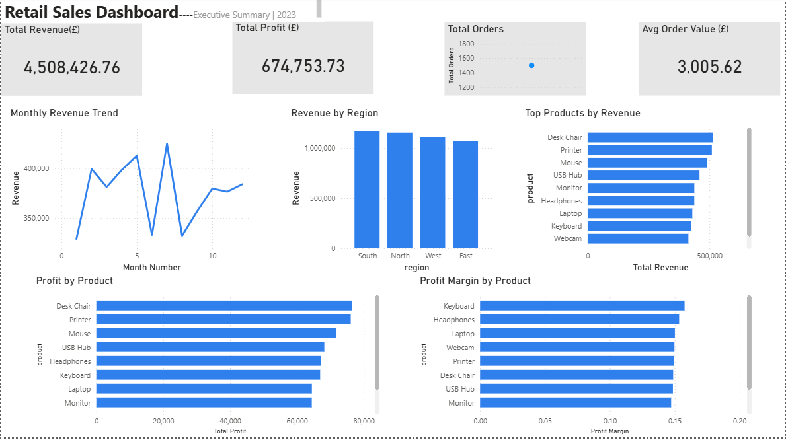
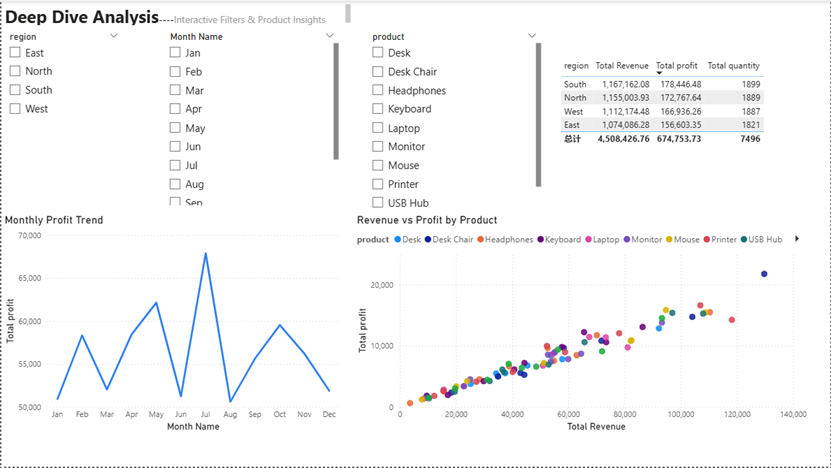
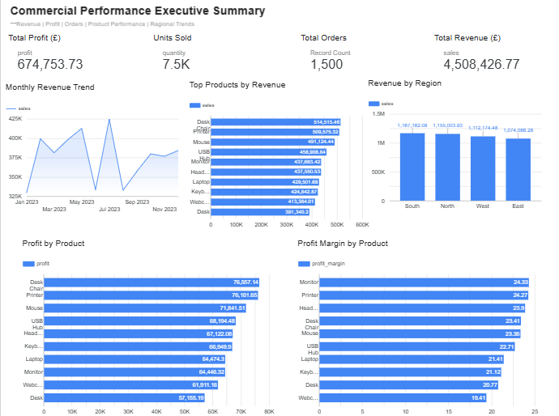
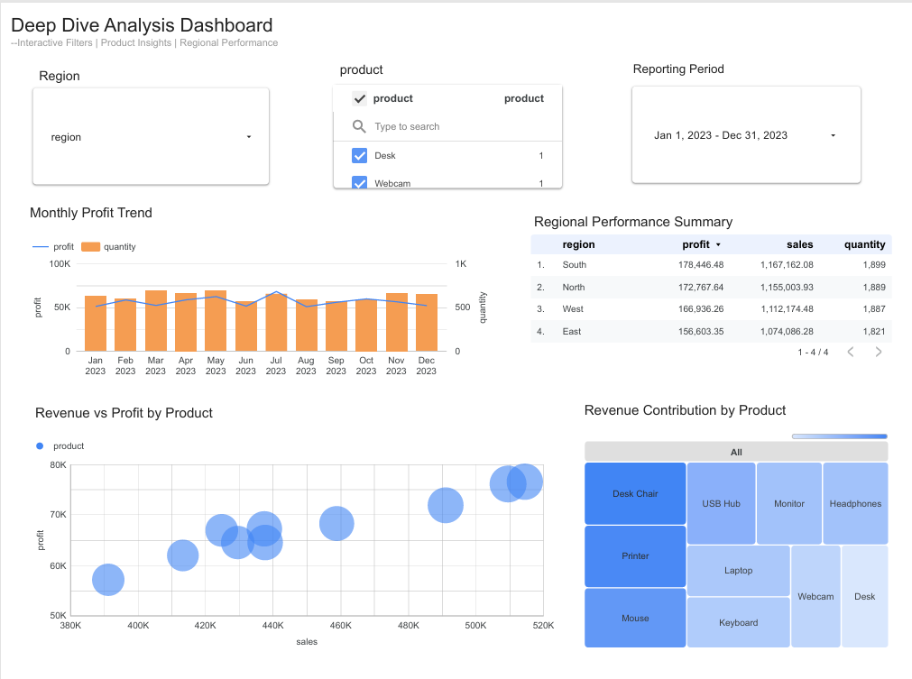

# End-to-End Retail Sales Analytics Project

## Project Overview
This project demonstrates an end-to-end data analytics workflow using **SQL Server, Power BI, and GitHub**.

The objective was to analyse retail sales performance, identify key business trends, and build an interactive dashboard for decision-making.

The project covers:

- Data extraction & analysis using SQL
- KPI and trend reporting
- Interactive dashboard creation in Power BI
- Business insights generation
- Portfolio publishing on GitHub

---

## Tools Used

- SQL Server
- Microsoft SQL Server Management Studio (SSMS)
- Power BI Desktop
- GitHub

---

## Dataset

Retail transactional sales dataset containing:

- Order Date
- Product
- Region
- Sales
- Profit
- Quantity

---

## SQL Analysis Performed

### KPI Summary

- Total Orders
- Total Revenue
- Total Profit
- Total Units Sold

### Regional Performance

Revenue and profit by region.

### Product Performance

Revenue, profit, and quantity sold by product.

### Monthly Trend Analysis

Monthly revenue and profit trend.

### Profit Margin Analysis

Calculated profit margin % by product.

### Average Order Value

Average revenue per order.

---

## Power BI Dashboard Pages

## Page 1 – Executive Summary

Includes:

- Total Revenue
- Total Profit
- Total Orders
- Average Order Value
- Monthly Revenue Trend
- Revenue by Region
- Top Products by Revenue
- Profit by Product
- Profit Margin by Product

## Page 2 – Deep Dive Analysis

Includes:

- Interactive slicers (Region / Product / Month)
- Monthly Profit Trend
- Revenue vs Profit Scatter Plot
- Regional Summary Table

---

## Key Insights

- Total revenue exceeded **£4.5M**
- Total profit reached **£674K**
- South region generated the highest revenue
- Desk Chair was the top-performing product
- Product margins varied significantly across categories
- Monthly sales performance fluctuated throughout the year

---

## Files Included

- `Retail-Sales-Dashboard.pbix`
- `SQLQuery1.sql`
- `retail_sales_dataset.csv`
- `dashboard-page1.png`
- `dashboard-page2.png`

---

## Dashboard Preview

(Add screenshots below after upload)

---

## Looker Studio Dashboard Preview

### Page 1 – Executive Summary

### Page 2 – Deep Dive Analysis

### Full Dashboard Report (PDF)

[Download Looker Dashboard PDF](looker/looker_dashboard.pdf)

---

## Author

Fengzhe Li

Aspiring Data Analyst | SQL | Power BI | Excel | Python
